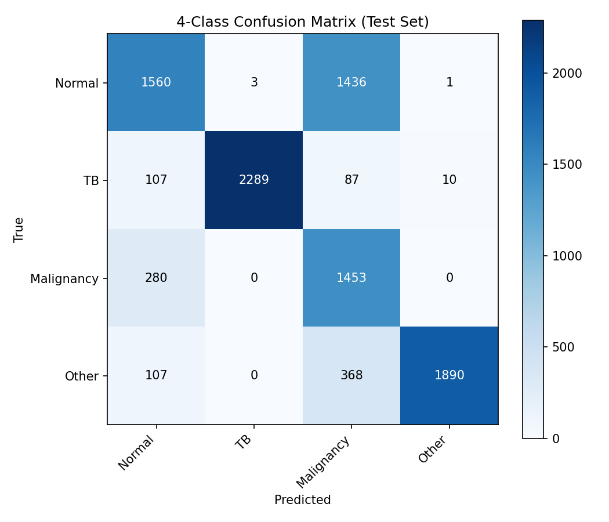
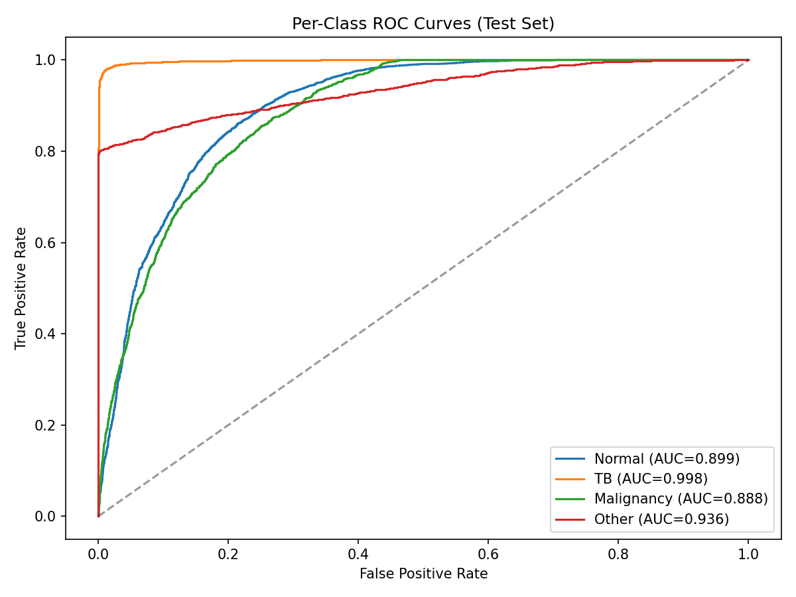

# Nepal-CXR-NET

**A deep learning triage system for chest X-ray analysis in TB-endemic, low-resource settings**

Sorasak Joshi · UCI MSBA Graduate · March 2026

> **Research prototype — not validated for clinical use.** This system has not been evaluated on Nepalese patient data, has not undergone ethics review, and is not approved for deployment in any clinical setting. See [Known Limitations](#known-limitations) for full disclosure.

Full write-up: [Nepal-CXR-NET on Notion](https://www.notion.so/32e2aebf771881ad8fd6db31c210790b)

---

## The Problem

In Nepal, there are roughly 0.7 radiologists per 100,000 people. At most district health posts, a single GP reads every chest X-ray with no specialist backup and no systematic referral protocol for uncertain findings. Nepal also carries one of the highest TB burdens globally approximately 117 cases per 100,000 people per year.

That epidemiological reality shapes clinical decision-making: when a chest X-ray shows a suspicious finding, TB is the rational default. The problem is that early lung malignancy and tuberculosis look nearly identical on a 2D radiograph. In a high-TB-prevalence setting, cancer can be systematically missed.

Nepal-CXR-NET models both conditions simultaneously and is designed from the start for the infrastructure constraints of rural Nepal: X-ray only, lightweight models, offline-capable inference.

---

## Design Philosophy

The system was designed around a single clinical principle: **miss nothing serious**. Every technical decision follows from this.

Model selection and training optimization are based on recall (sensitivity), not accuracy. The malignancy class receives the highest focal loss weighting because the cost of missing cancer is asymmetric with the cost of flagging it a false positive creates a referral; a false negative misses a cancer. Triage thresholds are configurable so individual clinical sites can dial sensitivity up or down based on local conditions: a teaching hospital in Kathmandu and a remote health post in Humla should not operate under the same sensitivity/specificity trade-off. The triage output is structured as Red / Amber / Green with probability breakdowns not raw probabilities to support clinical decision-making at the point of care rather than require numerical interpretation.

The core design question was: can a single system hold both TB and malignancy at once, and can it distinguish between them reliably enough to change clinical routing?

---

## What It Does

The system runs a chest X-ray through four sequential stages:

**Stage 1 — Bone Suppression (DLBS)**
A U-Net-style GAN with MobileNet inverted residual blocks suppresses rib shadows to improve visibility of soft-tissue findings. Trained on Gaussian-blur pseudo-pairs (σ=3.0).

**Stage 2 — Dual-Stream Classifier**
DenseNet121 (global context) + EfficientNet-B0 (nodule morphology), fused with CBAM channel-spatial attention. Four-class sigmoid output: Normal / TB / Malignancy / Uncertain/Other. ~14.77M parameters. Includes a configurable Safety Gate that soft-suppresses malignancy probability when TB signal is high.

**Stage 3 — YOLOv8-Nano Detector**
Eight pathology classes, 640×640 input, trained on NIH ChestX-ray14 with pseudo-bounding-box labels.

**Stage 4 — Triage Scorer**
Configurable thresholds map class probabilities to Red / Amber / Green risk levels with clinical routing recommendations.

**Clinical Interface**
React 18 + Vite 5 frontend. Upload a chest X-ray (DICOM or PNG/JPEG), receive a triage recommendation in under ten seconds, annotate the image directly (circles, arrows, text labels), attach patient information (name, ID, age, gender, study date), and export the full result as a formatted PDF clinical report.

**Safety Gate**
The system includes a configurable Safety Gate: when TB probability is high, the malignancy score is softly suppressed to reduce noise from TB-related features resembling cancer. The gate is kept soft and configurable rather than hard-coded because in a high-TB-prevalence setting, an aggressive gate would suppress malignancy signals almost everywhere. The gate behavior and thresholds are considered the highest-priority safety concern in the current design and are documented explicitly rather than abstracted away.

---

## Validation Results

### Four-Class Classifier — Held-Out Test Set (n = 10,226)

| Class | Sensitivity | Specificity | Precision | F1 | AUC |
|-------|:-----------:|:-----------:|:---------:|:--:|:---:|
| Normal | 52.0% | 92.5% | 76.0% | 0.617 | 0.899 |
| **TB** | **91.8%** | **99.96%** | **99.9%** | **0.957** | **0.998** |
| **Malignancy** | **83.8%** | 75.9% | 43.5% | 0.572 | **0.888** |
| Other/Uncertain | 79.9% | 99.9% | 99.4% | 0.886 | 0.936 |

### TB ↔ Malignancy Confusion — The Critical Clinical Metric

| Error Type | Count | Rate | Clinical Meaning |
|------------|:-----:|:----:|-----------------|
| **Malignancy misclassified as TB** | **0 / 1,733** | **0.0%** | **No cancer case dismissed as TB** |
| TB misclassified as Malignancy | 87 / 2,493 | 3.5% | Would trigger follow-up, not dismissal |

### Threshold Tuning — Operating Point Flexibility

| Class | Target Recall | Threshold | Achieved Recall | Precision | Specificity |
|-------|:------------:|:---------:|:--------------:|:---------:|:-----------:|
| TB | 90% | 0.539 | 90.2% | 99.9% | 99.96% |
| TB | 95% | 0.350 | 95.2% | 99.5% | 99.9% |
| TB | **98%** | 0.270 | **98.0%** | 96.3% | 98.7% |
| Malignancy | 90% | 0.485 | 90.0% | 39.4% | 69.4% |
| Malignancy | 95% | 0.469 | 95.0% | 36.3% | 63.3% |

### Confusion Matrix



### ROC Curves



### Other Components

| Component | Metric | Value | Note |
|-----------|--------|:-----:|------|
| YOLO Detector | mAP@0.50 (nodule) | 0.096 | Pseudo-label training; not radiologist-annotated |
| DLBS | Val L1 Loss | 0.0032 | Gaussian-blur pseudo-pairs, not real bone suppression ground truth |
| End-to-end inference | Speed (MPS) | ~10s/image | Single image on Apple Silicon |

---

## Clinical Interpretation

The four-class validation closes the most important open question in the system's development: does it genuinely distinguish TB from malignancy, or does it collapse one into the other?

**TB detection is excellent.** Sensitivity of 91.8% with AUC 0.998 means the classifier reliably identifies TB cases. At a lower threshold (0.27), 98% TB recall is achievable with 96.3% precision — suitable for high-sensitivity screening where missing a TB case carries the highest public health cost.

**Malignancy detection is validated but imperfect.** Sensitivity of 83.8% with AUC 0.888 confirms the system genuinely discriminates malignancy from other pathology. However, precision is low at 43.5%, meaning roughly one in two malignancy flags is a false positive. For a triage system whose purpose is to over-refer rather than under-refer, false positives represent appropriate caution, not failure. They do, however, create a real referral burden that needs to be quantified in a clinical context.

**Zero malignancy-as-TB errors is the most clinically meaningful number.** Not one of 1,733 malignancy test cases was dismissed as TB. The failure mode the system was most specifically designed to avoid — cancer being routed to the TB bucket and missed — does not appear in the test data. The reverse error (3.5% of TB cases flagged as potential malignancy) would still trigger clinical follow-up, not dismissal.

**Normal sensitivity is modest at 52%.** The classifier over-predicts malignancy for normal cases. In a triage context this means additional referrals for patients who do not have pathology. This is acceptable from a safety standpoint but creates clinical workflow cost that needs to be weighed against the referral capacity of the target setting.

---

## Repository Structure

```
nepal_cxr_net/             # Main Python package
├── models/
│   ├── dlbs/              # Bone suppression GAN (generator, discriminator)
│   ├── classifier/        # Dual-stream classifier (context stream, nodule stream, fusion)
│   ├── detector/          # YOLOv8 wrapper
│   └── fusion/            # CBAM attention blocks
├── data/
│   ├── loaders/           # Dataset loaders (TB, NIH, CheXpert, etc.)
│   └── preprocessing/     # CLAHE, normalization, harmonization pipeline
├── training/
│   ├── losses/            # Weighted focal loss, adversarial loss
│   ├── trainers/          # Training loops (classifier, detector, DLBS)
│   └── validators/        # Recall-first validators, comprehensive validator
├── deployment/
│   ├── inference/         # InferencePipeline (preprocess → DLBS → classify → detect → triage)
│   ├── ui/                # Flask app + API key auth
│   ├── cloud/             # ONNX export, cloud inference (planned)
│   ├── edge/              # Quantization (planned)
│   └── jetson/            # TensorRT helpers (planned, not tested)
├── federated/             # FedAvg/FedProx stubs + NVIDIA FLARE scaffolding (research only)
├── configs/               # deployment_config.yaml, training_config.yaml
└── utils/                 # Config loader, metrics, visualization overlays
frontend/                  # React 18 + Vite 5 clinical UI
├── src/
│   ├── App.jsx            # Main app: studies list, image viewer, results, report modal
│   └── components/        # ImageViewer, ResultsPanel, ReportModal, etc.
└── vite.config.js
scripts/                   # Training scripts
├── train_tb_classifier.py
├── train_4class_classifier.py
├── eval_4class.py
├── train_classifier.py
├── train_dlbs.py
├── train_detector.py
└── prepare_nih_bbox.py
config.yaml                # Root training config (TB/cancer classifier)
config_cancer.yaml         # Cancer-specific training config
```

---

## Known Limitations

These are stated explicitly and are not minimized.

**Label provenance.** The Malignancy labels are derived from the IQ-OTH/NCCD lung cancer dataset, which includes CT-derived 2D projections alongside native chest X-rays. Performance on native CXR malignancy cases may differ from reported results.

**No patient-level splitting.** The master dataset does not guarantee patient-level grouping between train and test. Metrics may be optimistic if images from the same patient appear in both sets.

**Single training run.** All results come from a single run with one random seed. No cross-validation was performed and no confidence intervals are reported.

**Identical input to both streams.** Both classifier streams received the same raw image during four-class training — the bone suppression GAN was not applied. Malignancy specificity may improve in deployment with DLBS active.

**No external validation.** All results are internal validation on held-out splits of the same distribution. The system has not been evaluated on any Nepalese patient data or external clinical dataset.

**Safety Gate.** The configurable gate that soft-suppresses malignancy when TB probability is high is considered the highest-priority safety concern in the current design. Its behavior has not been characterized on real clinical data.

---

## Clinical Feedback

The validation documentation was shared with seven doctors, a mix of general practitioners and radiologists across hospitals in Nepal including Medicity, Om Hospital, and Patan Academy of Health Sciences.

The most detailed response came from **Dr. Lochan Shrestha, MD**, Assistant Professor of Radiology at Patan Academy of Health Sciences, Lalitpur, Nepal — 15+ years of diagnostic radiology practice in Kathmandu and outreach clinic settings, reading 50–80 CXRs per day with the majority being TB suspects. His review ran six pages and engaged with the system at the level of clinical peer review.

**Overall verdict:** *"This is a thoughtful, well-targeted prototype that addresses a genuine unmet need in Nepal's health system. The TB discrimination result and zero critical misclassification are compelling. The system is not yet clinically ready, and the paper correctly states this."*

On the zero malignancy-as-TB result: *"This is the single most important number in the entire report. If this result holds on real Nepalese films, it would give clinicians genuine confidence to flag suspicious cases for further workup rather than defaulting reflexively to TB treatment."*

On the configurable threshold architecture: the design reflects clinical maturity — a teaching hospital in Kathmandu and a remote health post in Humla should not operate under the same sensitivity/specificity trade-off.

On the path forward: *"The clinical problem is real. The technical foundation is credible. The missing piece is Nepalese data."*

Dr. Shrestha named four realistic institutional partners for local dataset acquisition and external validation: the Nepal Radiologists Association, the National Tuberculosis Programme, Patan Academy of Health Sciences, and Tribhuvan University Teaching Hospital. He offered to collaborate directly on validation study design and dataset acquisition.

*"If the system performs reasonably on local data and workflow, it has the potential to become a meaningful second pair of eyes for overworked GPs across Nepal's peripheral health system."*

---

## Dataset Credits

Full credit to the original authors and data providers. Licenses apply as stated on each dataset's access page.

| Dataset | Citation | License | Link |
|---------|----------|:-------:|------|
| TB Chest Radiography Database (~4,200 images) | Rahman et al. (2020). *Computers in Biology and Medicine* | CC BY 4.0 | [Kaggle](https://www.kaggle.com/datasets/tawsifurrahman/tuberculosis-tb-chest-xray-dataset) |
| IQ-OTH/NCCD Lung Cancer Dataset (~1,097 images) | Alyasriy & Al-Huseiny (2023). *Mendeley Data V4*. doi:10.17632/bhmdr45bh2.4 | See Mendeley | [Mendeley](https://data.mendeley.com/datasets/bhmdr45bh2/4) · [Kaggle mirror](https://www.kaggle.com/datasets/hamdallak/the-iqothnccd-lung-cancer-dataset) |
| NIH ChestX-ray14 | Wang et al. (2017). *CVPR* | NIH terms | [NIH](https://nihcc.app.box.com/v/ChestXray-NIHCC) |
| CheXpert (Stanford) | Irvin et al. (2019). *AAAI* | Stanford terms | [Stanford](https://stanfordmlgroup.github.io/competitions/chexpert/) |
| Montgomery & Shenzhen TB Datasets | Jaeger et al. (2014). *Quant Imaging Med Surg* | See NLM | [NLM/NIH](https://lhncbc.nlm.nih.gov/LHC-downloads/downloads.html#tuberculosis-image-data-sets) |

---

## References

- Wang et al. ChestX-ray8: Hospital-scale chest X-ray database and benchmarks. CVPR. 2017.
- Irvin et al. CheXpert: A large chest radiograph dataset with uncertainty labels. AAAI. 2019.
- Liu et al. Rethinking computer-aided tuberculosis diagnosis. CVPR. 2020.
- Jaeger et al. Two public chest X-ray datasets for computer-aided screening of pulmonary diseases. Quant Imaging Med Surg. 2014.
- Dhungana et al. Clinicopathological profile of lung cancer: a study from a tertiary care center in Nepal. Asian Pac J Cancer Prev. 2019.
- Lin et al. Focal loss for dense object detection. ICCV. 2017.
- Alyasriy & Al-Huseiny. The IQ-OTH/NCCD lung cancer dataset. Mendeley Data. 2023.
